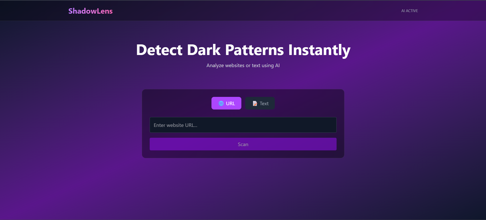
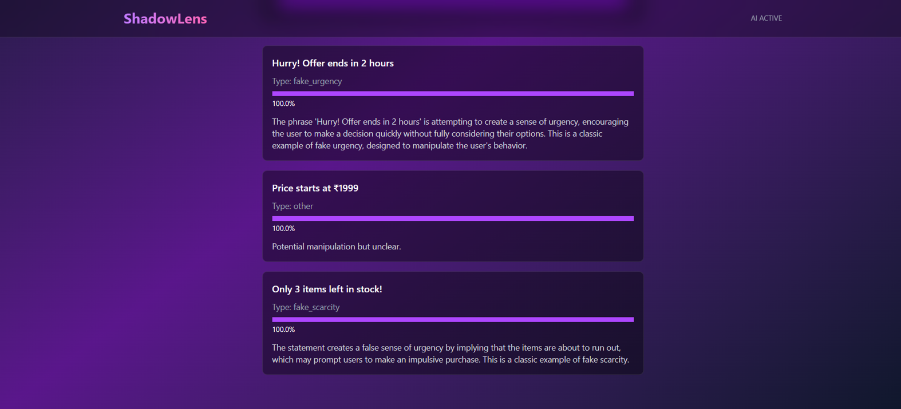
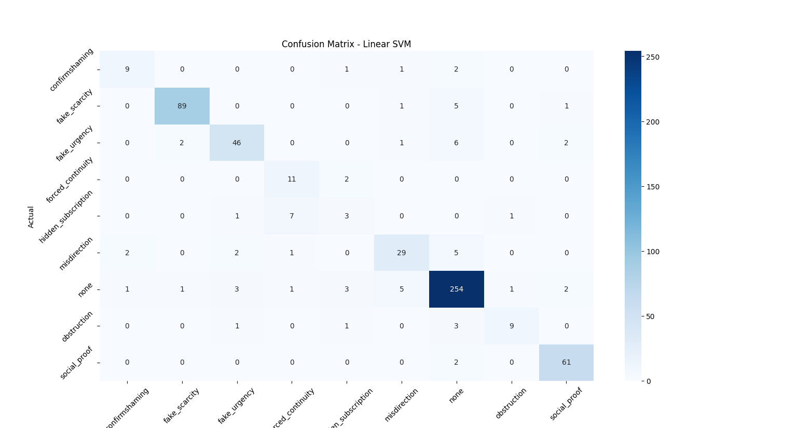

# ShadowLens – Dark Pattern Detector

ShadowLens is an AI-powered system designed to detect **dark patterns in user interfaces** using machine learning and LLM-based reasoning.
It analyzes both **raw text** and **live websites**, identifies manipulative UX patterns, and provides explanations for detected behaviors.

---

## Overview

Dark patterns are deceptive UI/UX practices that manipulate user decisions (e.g., fake urgency, hidden subscriptions).
ShadowLens addresses this problem by combining:

* Traditional ML (TF-IDF + Linear SVM)
* Rule-based heuristics
* LLM-based explanation layer (Ollama – Llama3)

The system supports:

* Text-based detection
* URL-based analysis via scraping (Requests + Selenium)
* Explainable outputs for each detected pattern

---

## Features

* Multi-class classification of dark patterns:

  * fake_scarcity
  * fake_urgency
  * confirmshaming
  * obstruction
  * forced_continuity
  * hidden_subscription
  * social_proof
  * misdirection
  * none

* Hybrid detection system:

  * ML prediction (Linear SVM)
  * Rule-based overrides for edge cases
  * LLM explanation layer for interpretability

* URL analysis:

  * Scrapes webpage content (Requests / Selenium)
  * Filters relevant text
  * Detects high-confidence dark patterns

* Confidence scoring for predictions

* React-based UI for real-time interaction

---


## Screenshots

### Home Interface



### Analysis


## Tech Stack

### Machine Learning

* scikit-learn
* Linear SVM (best performing model)
* TF-IDF Vectorizer (1–3 grams)

### Backend

* Flask API 
* Selenium + BeautifulSoup (web scraping)
* Ollama (Llama3) for explanation layer

### Frontend

* React + Tailwind CSS 
* Axios for API communication

### Tools

* Python, Pandas, NumPy
* GitHub, VS Code, Postman

---

## Dataset

* ~300+ manually curated samples
* Additional data from Kaggle datasets
* Final dataset merged and normalized

### Preprocessing Steps

* Label normalization (merged similar classes)
* Duplicate removal
* Text cleaning and augmentation
* Class balancing using `class_weight`

---

## Model Training

Three models were trained and evaluated:

| Model               | Accuracy   |
| ------------------- | ---------- |
| Logistic Regression | 0.8581     |
| Naive Bayes         | 0.8374     |
| **Linear SVM**      | **0.8841** |

**Selected Model:** Linear SVM

### Key Techniques

* TF-IDF (ngram_range = 1–3)
* Custom text preprocessing
* Heuristic feature injection (urgency signals)
* Stratified train-test split

---

## Evaluation

* Accuracy: **88.4%**

* Strong performance on:

  * fake_scarcity
  * social_proof
  * none

* Weak areas:

  * hidden_subscription (low recall)
  * minority classes due to dataset imbalance

Confusion matrix highlights class-wise performance:



---

## System Architecture

1. Input (Text / URL)
2. Preprocessing (clean_text)
3. TF-IDF Vectorization
4. ML Prediction (Linear SVM)
5. Rule-based override (critical cases)
6. LLM Explanation (if non-neutral)
7. Response (type + confidence + explanation)

---

## API Endpoints

### 1. Predict Text

```
POST /predict
```

**Request:**

```json
{
  "text": "Hurry! Only 2 items left!"
}
```

**Response:**

```json
{
  "input": "...",
  "prediction": "fake_scarcity",
  "confidence": 0.92,
  "analysis": {
    "type": "fake_scarcity",
    "explanation": "Creates pressure by suggesting limited availability."
  }
}
```

---

### 2. Analyze URL

```
POST /analyze-url
```

**Request:**

```json
{
  "url": "https://example.com",
  "mode": "selenium"
}
```

**Response:**

```json
{
  "url": "...",
  "detections": [
    {
      "text": "...",
      "type": "fake_urgency",
      "confidence": 0.88,
      "analysis": {...}
    }
  ]
}
```

---

## Frontend

* Single-page interface
* Supports:

  * URL scanning
  * Text analysis
* Displays:

  * Prediction type
  * Confidence bar
  * LLM explanation

---

## Setup Instructions

### 1. Clone Repository

```bash
git clone <repo-url>
cd ShadowLens
```

### 2. Install Backend Dependencies

```bash
pip install -r requirements.txt
```

### 3. Train Model

```bash
python join_datasets.py
python train_models.py
```

### 4. Run Backend

```bash
python app.py
```

### 5. Setup Frontend

```bash
cd frontend
npm install
npm run dev
```

---

## Future Improvements

* Image-based dark pattern detection (UI screenshot analysis)
* RAG pipeline with vector database for better LLM context filtering
* Dataset expansion for minority classes
* Model optimization using transformers (BERT-based classifiers)
* Browser extension for real-time detection

---

## Limitations

* Performance depends on dataset quality and class balance
* Limited accuracy on rare dark pattern categories
* LLM explanations depend on local Ollama availability
* Scraping may fail on heavily dynamic or protected websites

---

## Conclusion

ShadowLens demonstrates a practical approach to detecting dark patterns using a hybrid AI system.
By combining classical ML with modern LLM reasoning, it provides both **accurate detection** and **interpretable insights**.

---

## Author

Built as part of an applied ML + full-stack project focusing on real-world UX manipulation detection.
